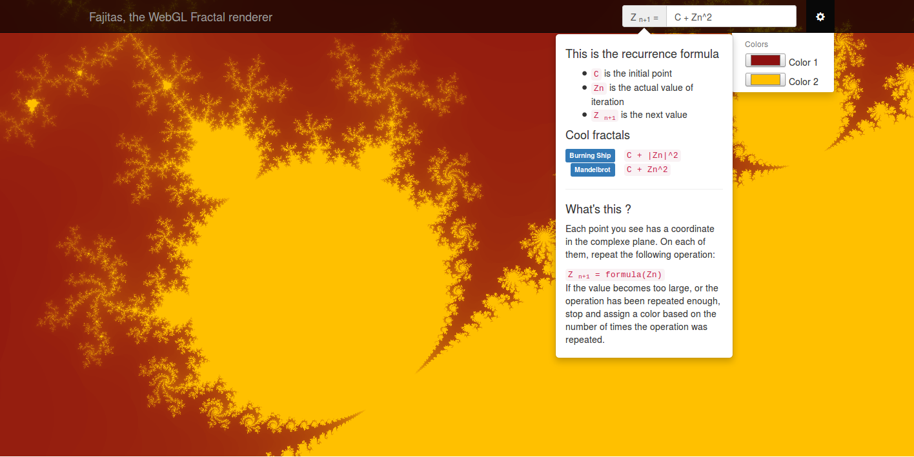
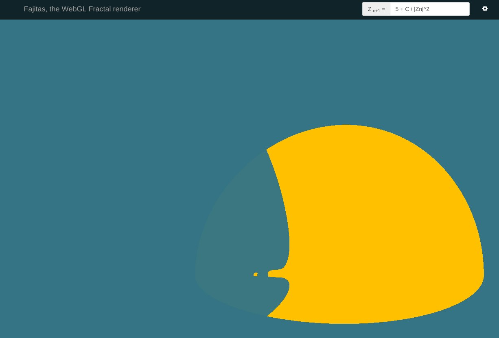

# Fajitas

A WebGL escape-time fractals renderer with a math-to-shader compiler.
It currently supports:

* Modifiable iterations count (numpad `+` and `-`)
* Navigation using mouse clicks and wheel
* Shareable urls that include the fractal equation, and the current position and zoom level for reproductible views

**[Live demo](http://ititou.be/)**

## Build

    $ npm install
    $ make

## Run

Simply open `index.html` with your favorite *(recent)* web browser.
